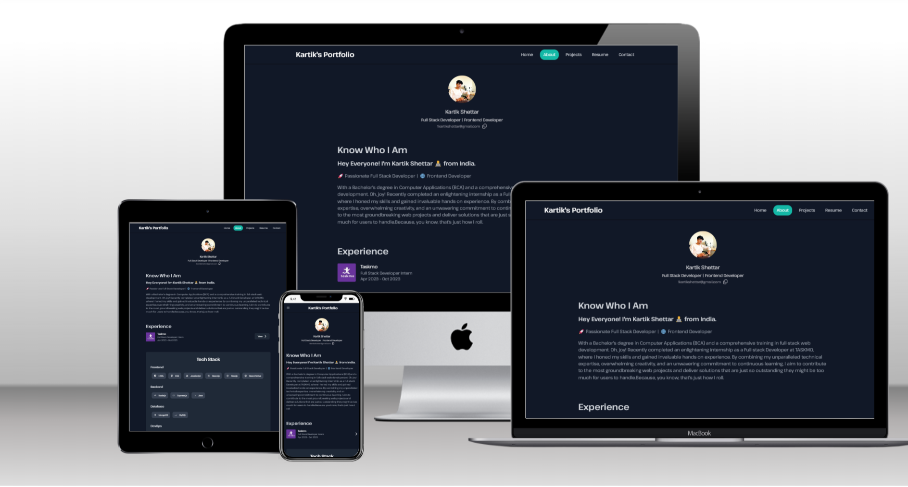

<h2 align="center">
 Kartik's Portfolio Website - v2.0 
  <a href="https://kartik-devloper.netlify.app" target="_blank">Kartik</a>
</h2>

  

 

My personal portfolio <a href="https://kartik-shettar.netlify.app" target="_blank">Kartik</a> which features some of my github projects as well as my resume and technical skills. 

This project was built using these technologies.

- React.Js
- Node.js
- Tailwind
- VsCode
- Netlify

## Features

**📖 Multi-Page Layout**

**🎨 Styled with Tailwind with easy to customize colors**

**📱 Fully Responsive**
